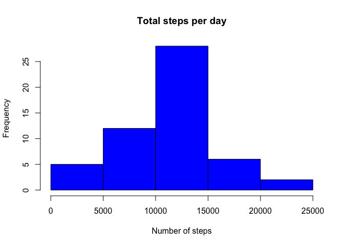
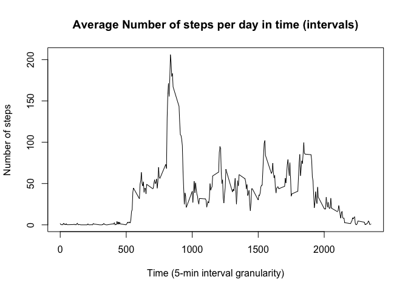
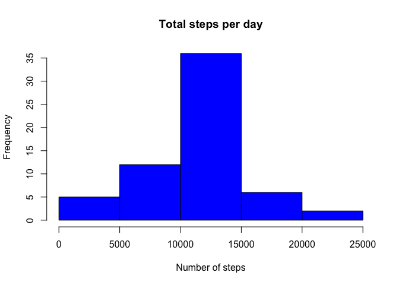
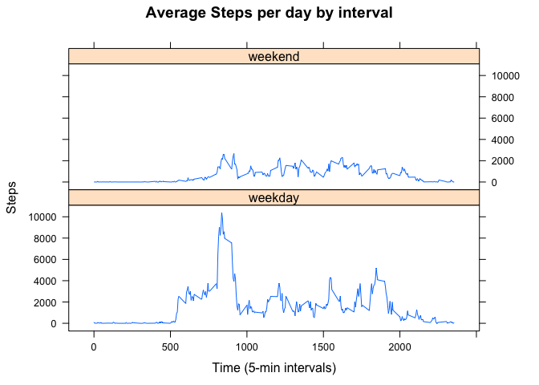

# Reproducible Research: Project Assignment 1
af  
6 February 2016  
## Loading and preprocessing the data
Firstly, the data are downloaded from [here](http://d396qusza40orc.cloudfront.net/repdata%2Fdata%2Factivity.zip), unzipped and read through the *read.csv* function. The resulting data frame is stored as *data*.


```r
data <- read.csv("activity.csv")
```

As regarding the preprocessing, the observation number is inserted in the dataset:


```r
data$observations <- 1:nrow(data)
```

## What is mean total number of steps taken per day?
The data are aggregated by date and the total number of steps per day is calculated. The results are stored in another data frame called *steps_per_day*.


```r
steps_per_day <- aggregate(steps ~ date, data, FUN = sum)
```

The distribution of the steps per day can be approximated by the following histogram:


```r
hist(steps_per_day$steps, main = paste("Total steps per day"), col="blue", xlab="Number of steps")
```



The mean is:


```r
meanQ2 <- mean(steps_per_day$steps)
print(meanQ2)
```

```
## [1] 10766.19
```

While the median:

```r
medianQ2 <- median(steps_per_day$steps)
print(medianQ2)
```

```
## [1] 10765
```

## What is the average daily activity pattern?

To answer this question, the data are aggregate by *interval* and the mean of each group is calculated. The results are stored in a new data frame called *avg_steps_interval*:


```r
avg_steps_interval <- aggregate(steps ~ interval, data, FUN = mean)
```

The results are shown in the figure below:


```r
with(avg_steps_interval, plot(interval, steps, type="l", xlab="Time (5-min interval granularity)", ylab="Number of steps",main="Average Number of steps per day in time (intervals)"))
```



The interval with the maximum number of steps per day is:


```r
max_interval <- with(avg_steps_interval, interval[which.max(steps)])
```

## Imputing missing values

The number of total missing value is:


```r
total_NA <- length(data$steps[is.na(data$steps)])
print(total_NA)
```

```
## [1] 2304
```

The missing value in the dataset *data* are filled by using the mean per interval across all days, as follows:


```r
tmp <- merge(data,avg_steps_interval, by = "interval")
tmp <- tmp[order(tmp$observations), ]
filled_data <- data
filled_data$steps[is.na(filled_data$steps)] <- tmp$steps.y[is.na(filled_data$steps)]
```

The resulting histogram is the following:

```r
filled_steps_per_day <- aggregate(steps ~ date, filled_data, FUN = sum)
hist(filled_steps_per_day$steps, main = paste("Total steps per day"), col="blue", xlab="Number of steps")
```



After filling the data, the mean is:

```r
meanQ4 <- mean(filled_steps_per_day$steps)
print(meanQ4)
```

```
## [1] 10766.19
```

And the median is:

```r
medianQ4 <- median(filled_steps_per_day$steps)
print(meanQ2)
```

```
## [1] 10766.19
```

They do not differ very much from the ones calculated in question 2.

## Are there differences in activity patterns between weekdays and weekends?

First of all, a column is added to the filled data frame, containing a factor variable whose value is either "weekday" or "weekend" according to the day of the week in the variable *date*.


```r
dates <- as.Date(filled_data$date)
days <- weekdays(dates)
weekend <- c("Saturday","Sunday")
filled_data$daytype <- as.factor(ifelse(is.element(days,weekend), "weekend", "weekday"))
```

The data can now be aggregated and visualised:


```r
require(lattice)
```

```
## Loading required package: lattice
```

```r
steps_per_interval_day <- aggregate(steps ~ interval + daytype, filled_data, FUN = sum)
xyplot(steps_per_interval_day$steps ~ steps_per_interval_day$interval|steps_per_interval_day$daytype, main="Average Steps per day by interval",xlab="Time (5-min intervals)", ylab="Steps",layout=c(1,2), type="l")
```


